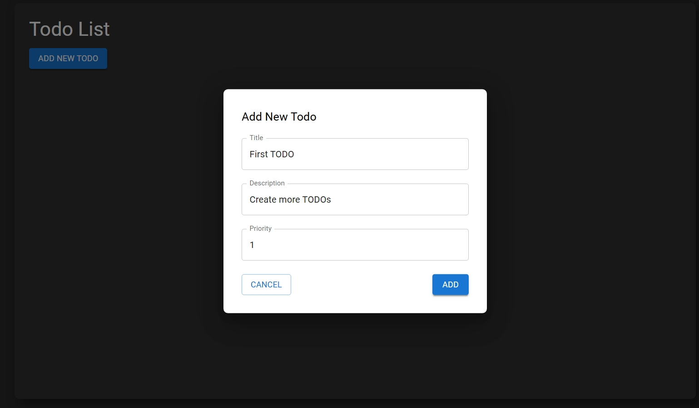
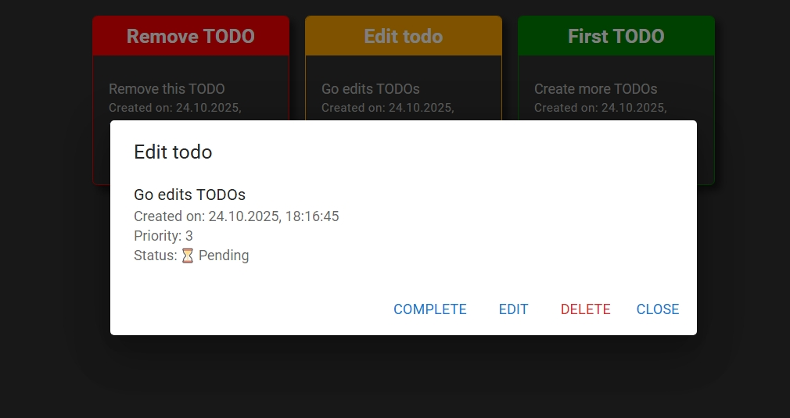
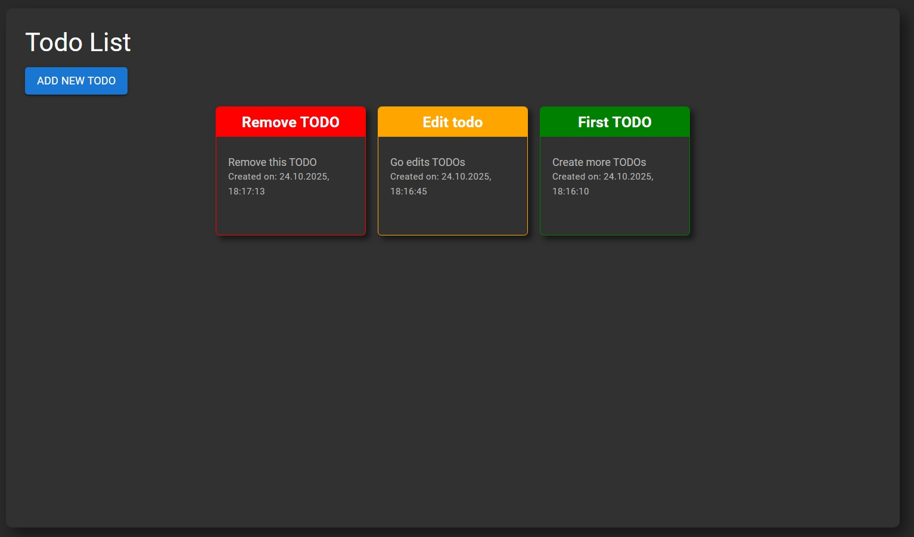

# Simple TODO App

Simple TODO App — a web application for managing personal tasks.

- Developed the frontend using React (React, Axios, MUI).
- Implemented a REST API with Node.js + Express for creating, reading, updating, and deleting tasks.
- Stored tasks in MongoDB using Mongoose ORM.
- Added task filtering by priority.

Technologies used: React, Express, MongoDB, Git.

## Visualization

Create form:

Modal view:

Workplace:

